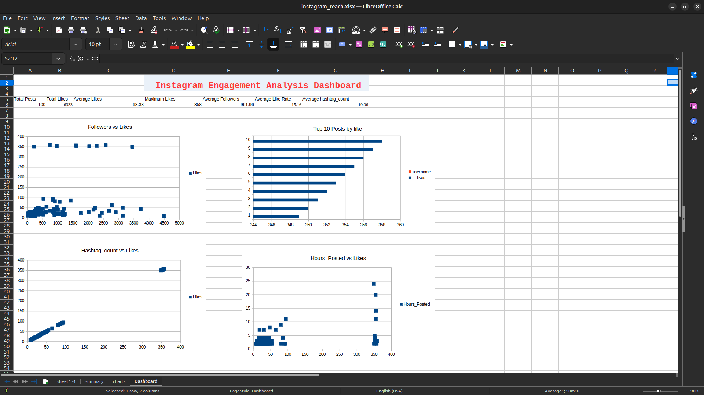

# Social Media Reach Analysis

## Project Objective
Analyze Instagram engagement data and identify factors affecting post performance.

## Tools Used
- LibreOffice Calc
- Excel
- GitHub

## KPIs
- Total Posts: 100
- Total Likes: 6333
- Average Likes: 63.33
- Maximum Likes: 358
- Average Followers: 961.96
- Average Like Rate: 15.16
- Average Hashtag Count: 19.06

## Visualizations
- Top 10 Posts by Likes
- Followers vs Likes
- Hashtag Count vs Likes
- Hours Posted vs Likes

## Dashboard
Dashboard screenshot included in repository.
 
 ##Dashboard Preview
 
